# 🔐 SCR 1.0 - Secure Cyber Reconnaissance Platform

A fully functional cybersecurity reconnaissance platform with real-time scanning, encrypted data storage, and a sleek animated UI — built for ethical hackers, cybersecurity analysts, and developers.


---

## 📚 Table of Contents

- [Features](#features)
- [Screenshots](#screenshots)
- [Default Admin Credentials](#default-admin-credentials)
- [Database Configuration](#database-configuration)
  - [PostgreSQL (Default)](#postgresql-default)
  - [MySQL Configuration](#mysql-configuration)
  - [SQLite (Development)](#sqlite-development)
- [Running the Application](#running-the-application)
- [Security Features](#security-features)
- [Report Generation](#report-generation)
- [Customization](#customization)
- [License](#license)
- [Contributions](#contributions)

---

## 🚀 Features

- User authentication with admin and regular user roles  
- Domain reconnaissance (WHOIS, DNS records, IP information)  
- Vulnerability scanning (Missing headers, XSS, SQL injection detection)  
- Port scanning for open services  
- Risk scoring and detailed reporting  
- PDF report generation  
- Data encryption for sensitive information  
- Dark-themed, animated UI with charts and visualizations  

---

## 🖼️ Screenshots

| Login Page | Register Page |
|------------|---------------|
| 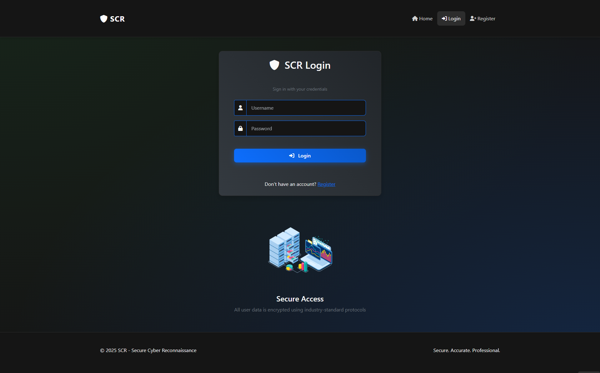 | 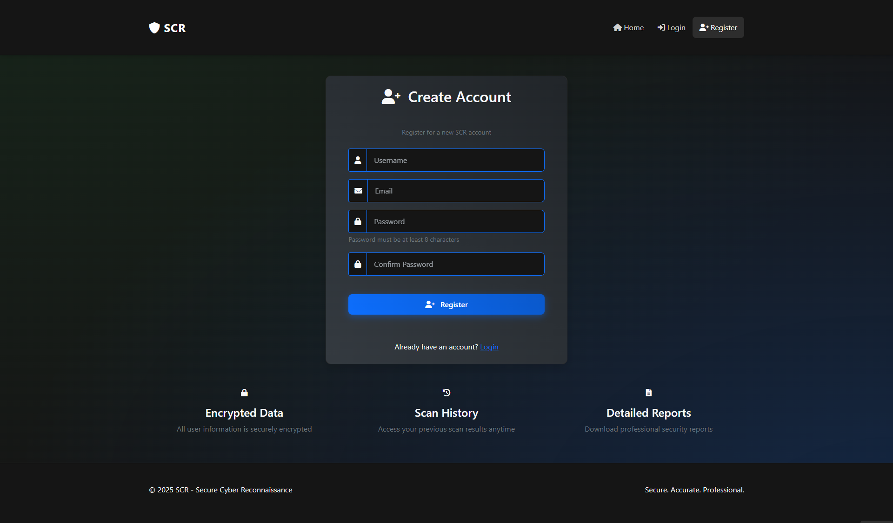 |

| Home Page | Dashboard |
|-----------|-----------|
| 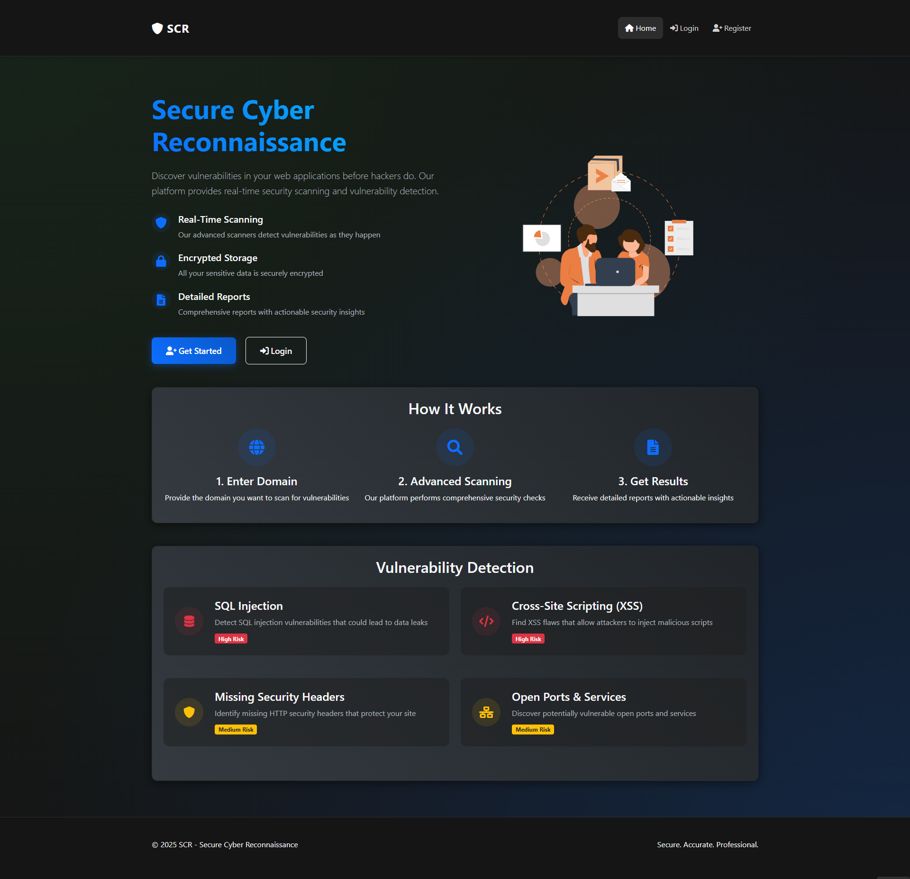 | 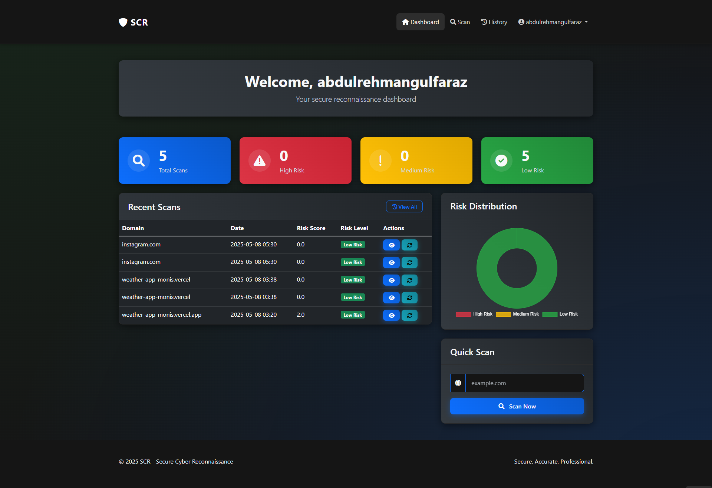 |

| Admin Dashboard | Domain Management |
|------------------|------------------|
| 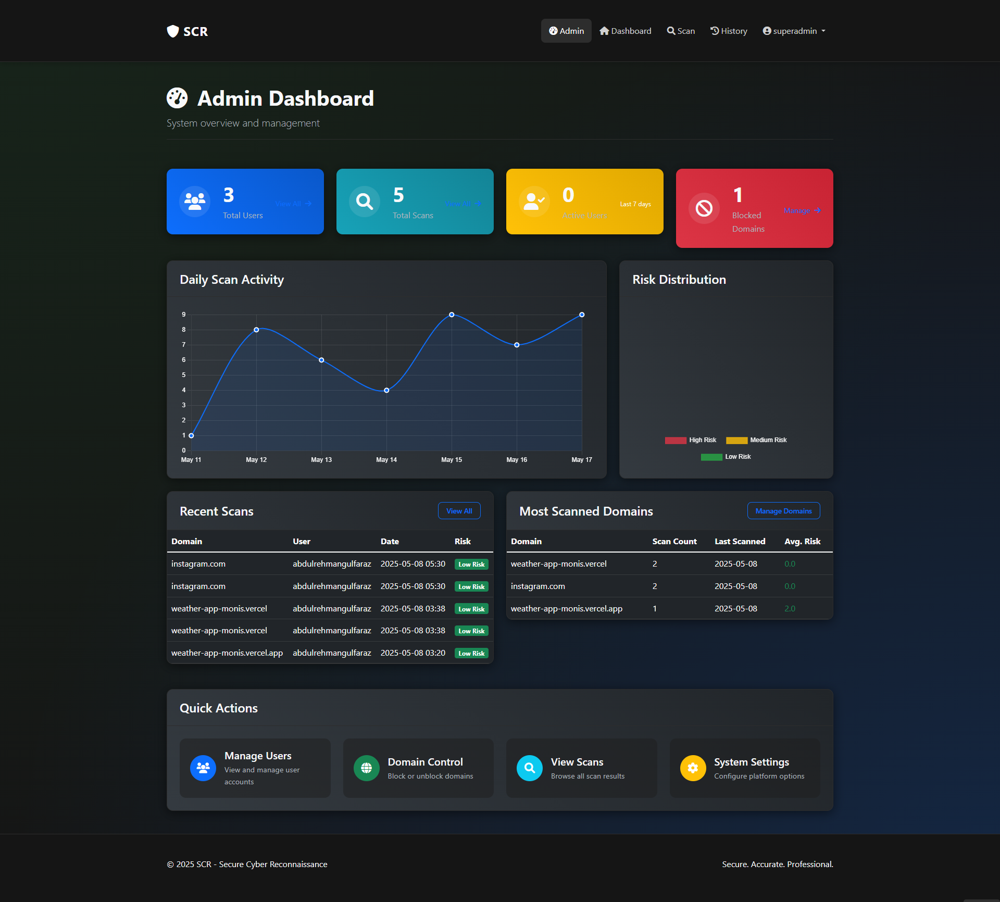 | 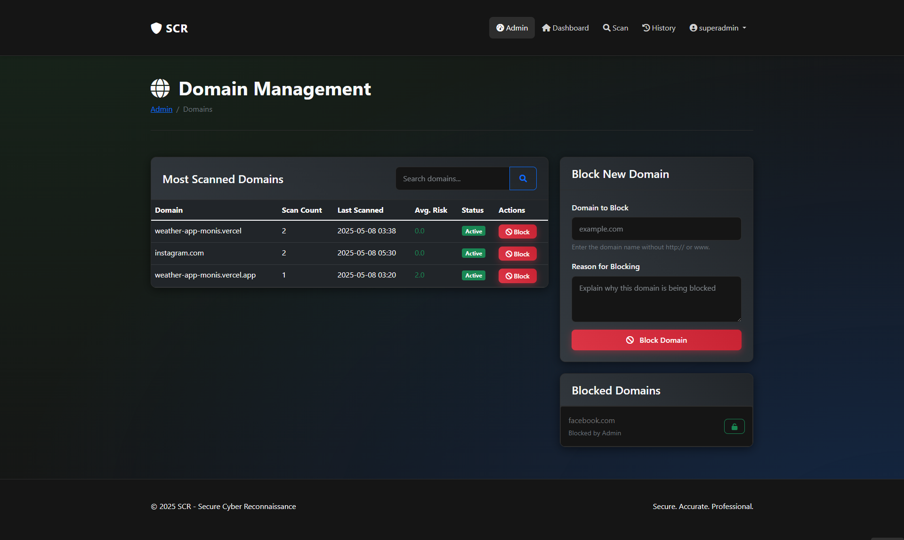 |

| Scan Page | Perform Scan |
|------------|--------------|
| 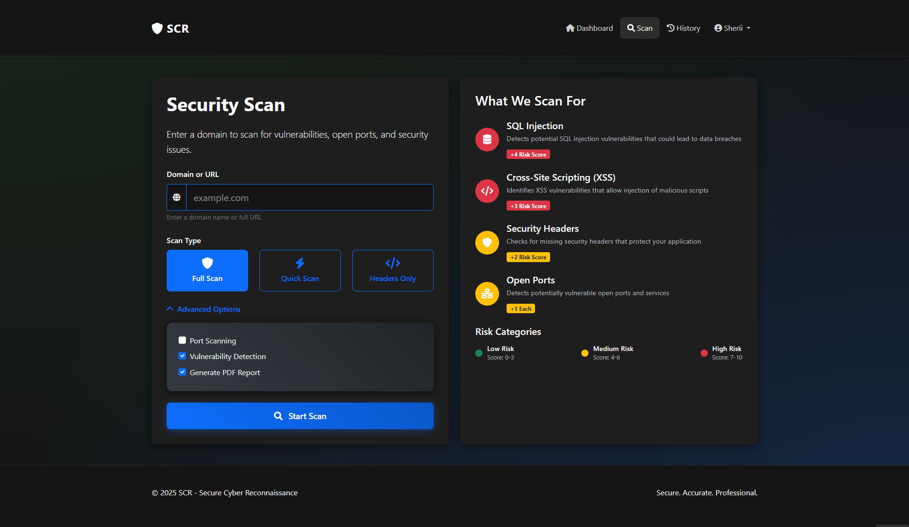 | 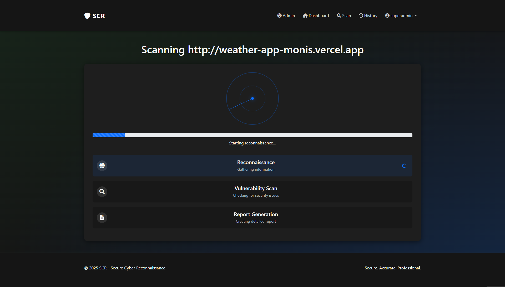 |

| Scan History | User Management |
|--------------|-----------------|
| 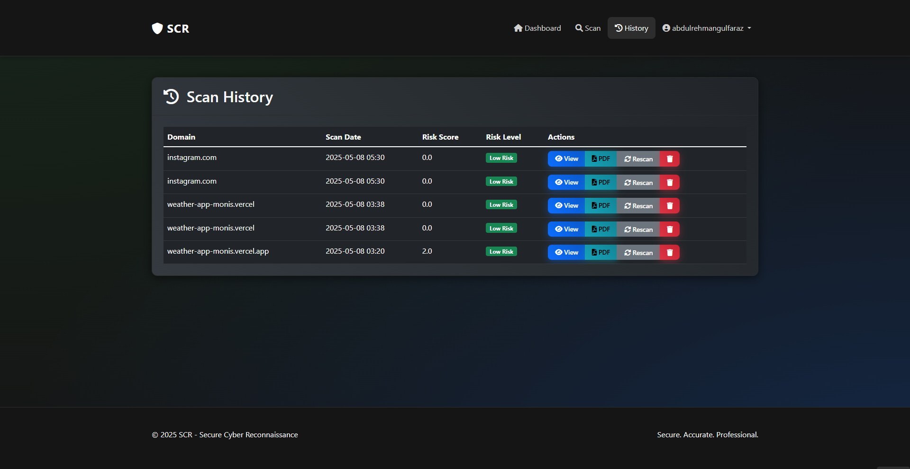 | 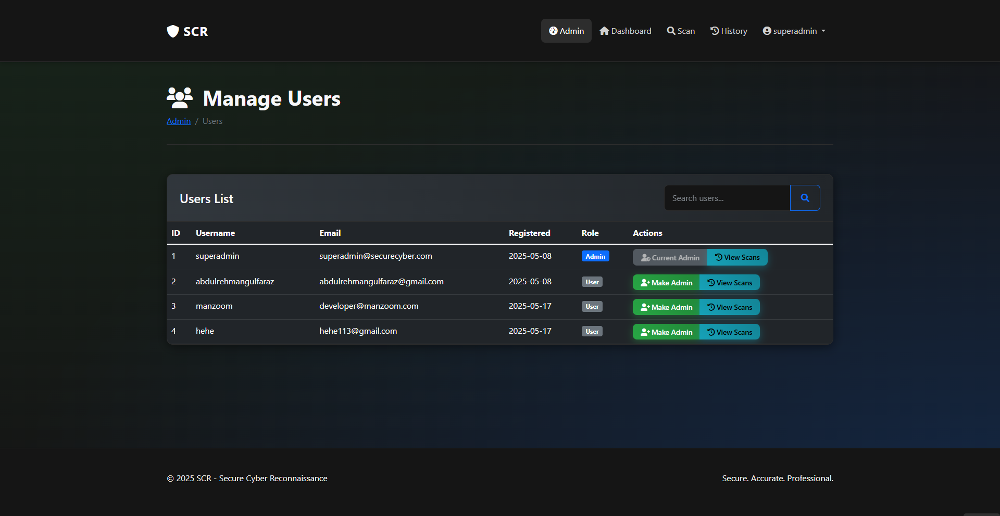 |

| Profile |
|---------|
| 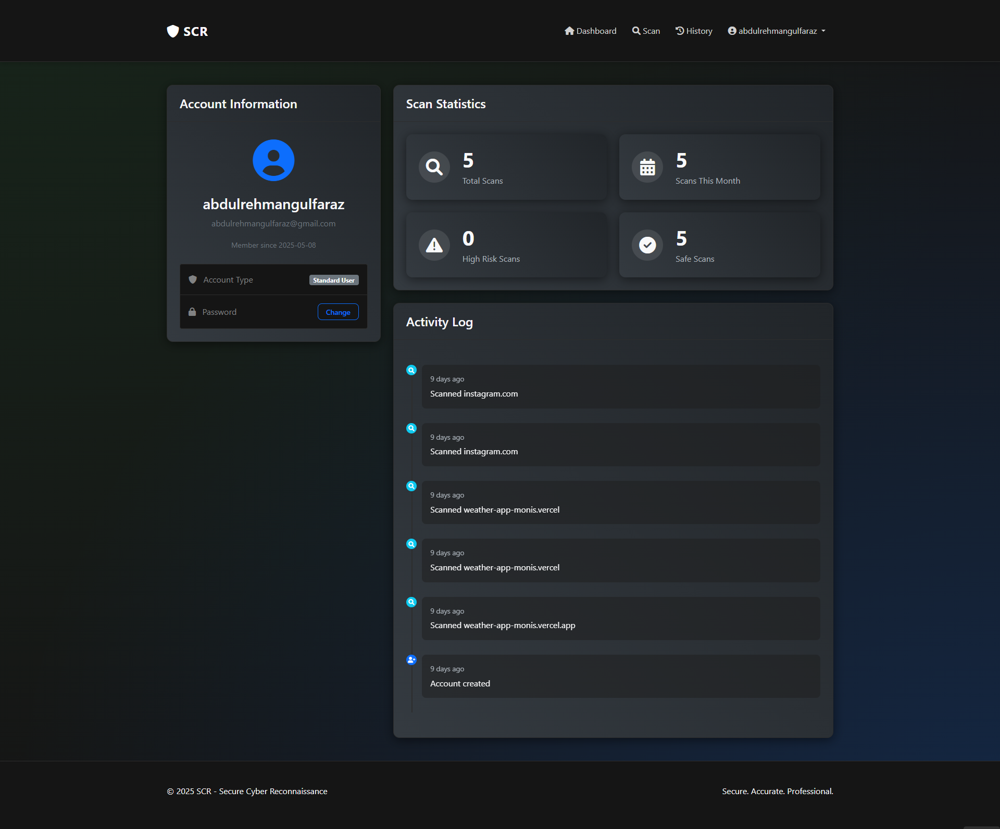 |


---

## 🔑 Default Admin Credentials

The platform comes with pre-configured administrator credentials:

- **Username:** `superadmin`  
- **Password:** `Abdulrehman@123!`

Please change these credentials in production environments.

---

## 🛠️ Database Configuration

SCR supports multiple database backends:

### 🐘 PostgreSQL (Default)

The application uses PostgreSQL by default.  
Set the connection string in the `DATABASE_URL` environment variable.

---

### 🐬 MySQL Configuration

To use MySQL as the database backend:

1. Install PyMySQL:
   ```bash
   pip install pymysql
   ```

2. Run the helper script:
   ```bash
   python mysql_setup.py --host your-mysql-host --user your-username --password your-password --database scr_platform
   ```

3. Set the `MYSQL_DATABASE_URL` environment variable using the connection string from the setup.

---

### 💾 SQLite (Development)

For local development without a database server, the app will automatically use SQLite, creating `scr.db` in your project directory.

---

## 💻 Running the Application

1. Install the dependencies:
   ```bash
   pip install -r requirements-note.txt
   ```

2. Start the app:
   ```bash
   python main.py
   ```

3. Open your browser and visit:  
   `http://localhost:5000`

---

## 🛡️ Security Features

- Password hashing via Werkzeug security  
- Fernet encryption for sensitive data  
- Session protection with Flask-Login  
- Input validation and sanitization  
- Admin-controlled domain blocking  

---

## 📄 Report Generation

Each scan produces a detailed downloadable PDF report including:

- Vulnerability findings with severity indicators  
- Open ports and detected services  
- WHOIS, DNS, and IP geolocation details  
- Risk score summary and recommendations  

Reports are accessible from the scan results dashboard.

---

## ⚙️ Customization

To change scanning parameters or add new types:

- Edit or extend `vulnerability_scanner.py`  
- You may also add new visualizations under the UI components directory  
- Adjust risk thresholds or scoring logic in `report_generator.py`

---

## 📄 License

This project is licensed under the [MIT License](LICENSE).  
You may use, modify, and distribute the code with attribution.

---

## 🌐 Connect With Me

- [LinkedIn](https://www.linkedin.com/in/abdulrehman-gulfaraz)
- [GitHub](https://github.com/abdulrehmangulfaraz)


---

## 🤝 Contributions

Contributions are welcome!  
To contribute:

1. Fork the repository
2. Create a new feature or bugfix branch
3. Submit a pull request

Please open an issue first for major changes or suggestions.

---
